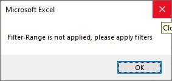
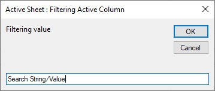
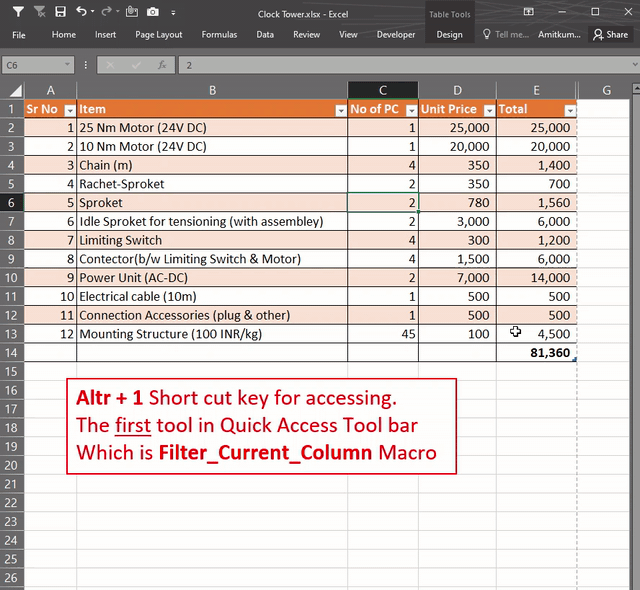

# Filter_Current_Column
VBA-Macro to enhance productivity in Excel-Data-Filtering

## Manual

If filter is not applied in data-set, then following error will be prompted.

"+" sign adds the filter into current filtered/non-filtered data-set.

If "+" sign is not added into first , then all filters will be wiped & new filter will be applied.

***Demo***

## Installation

1. Adding macro to a **Personal Macro Workbook**, so that it can be called into any opened Excel Workbook. https://support.office.com/en-us/article/Copy-your-macros-to-a-Personal-Macro-Workbook-AA439B90-F836-4381-97F0-6E4C3F5EE566 
2. Adding Macro in **Quick Access Toolbar** https://www.howtogeek.com/232620/how-to-add-a-macro-to-the-quick-access-toolbar-in-office/
